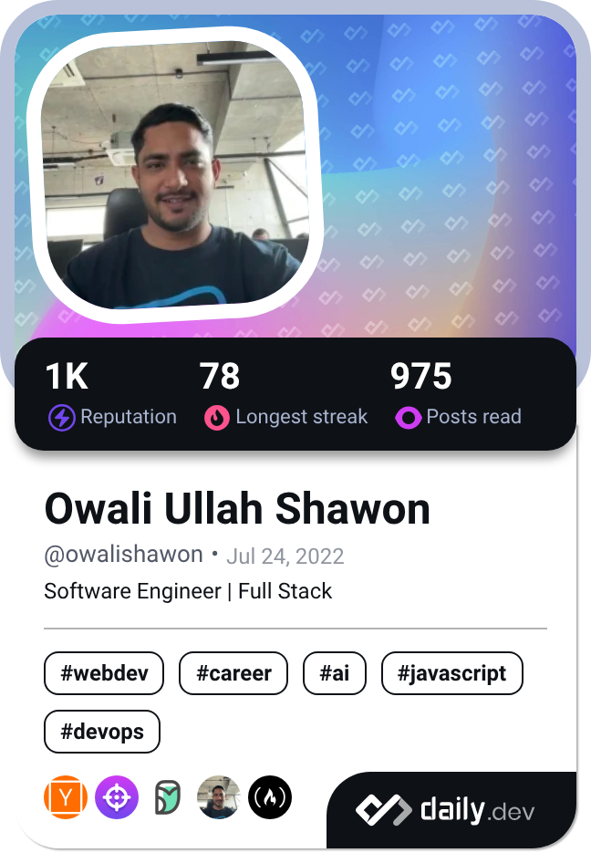

### Hi there 👋
<!--
**OwaliShawon/OwaliShawon** is a ✨ _special_ ✨ repository because its `README.md` (this file) appears on your GitHub profile.
-->
<table>
  <tr>
    <td>
      
    </td>
    <td>
      
      
    </td>
  </tr>
</table>

